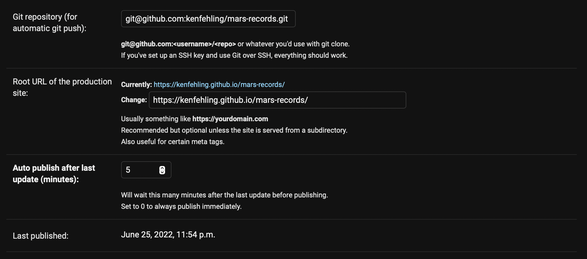
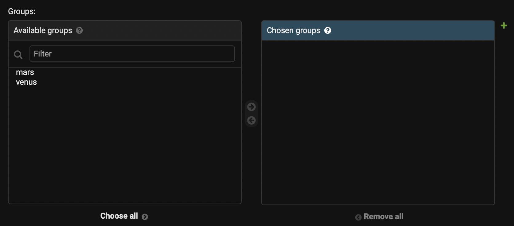

# Django Micro CMS/SSG Starter #
Starter project / proof of concept for a simple, or "micro"
Content Management System (CMS) 
combined with a Static Site Generator (SSG).

## Features ##
* Simple back office built on top of
[Django Admin](https://docs.djangoproject.com/en/4.0/ref/contrib/admin/)
with some enhancements
* Static site generation using 
[django-distill](https://github.com/meeb/django-distill)
* Multi-site support
* Automatically manages role groups and permissions for individual sites
* Automatically pushes generated sites to Git on updates
* Image optimization

## Philisophy ##
This was created with a web agency in mind, building sites for
several different clients. Whether what it provides is a CMS is
debatable and depends on your defintion of CMS.
It attempts to provide something more like
[KeyStoneJS](https://keystonejs.com/) than Wordpress.

It's based on the following premises:
* Clients typically want to do minimal updates
(e.g. changing information, adding new items).
* Overloading nontechnical users with too many options makes them
averse to doing any updates at all.
* A monolithic system where the CMS and SSG are unified has
less cognitive overhead for developers than a system where they are
separate parts connected by GraphQL or some other API.
* The Python/Django ecosystem is powerful enough to rival
popular SSGs like Gatsby and NextJS.
* Projects like
[petite-vue](https://github.com/vuejs/petite-vue) make it natural to
sprinkle reactive components onto a server-rendered
(or in this case statically generated) page, similar to the
[Islands Architecture](https://www.patterns.dev/posts/islands-architecture)
idea.

## Example sites ##
The starter kit comes with two demo sites, which are published here:
* [Record store](https://kenfehling.github.io/mars-records)
* [Cat cafe](https://kenfehling.github.io/venus-cats)


## Usage ##

### With Docker ###
A Dockerfile is provided that does the setup for you.
Run this command to build and run the container:
```
bash docker/run.sh
```

### Without Docker ###
This script will install all dependencies and setup the database.

Note: It doesn't create a virtual environment so you should do that if you want.
```
bash scripts/init.sh
```

### Site setup ###
For each site, create a Django app like you normally would,
but also add the site to the list of SITES in config.py.
In the Admin UI you can set the Git repo and the root URL for the build.
Sites are added to this menu automatically.



### Admin accounts ###
There are no users or login credentials created by default. Create accounts in Django as you would normally.

### Site groups ###
Groups are automatically created for each site in the SITES list.
To give a user access to control a site, simply add them to the group
and they automatically get all permissions associated with that site.




### Publishing sites ###
If there is a Git repository configured for the site it will automatically
push after some number of minutes since the last update made.
After that it's the usual process of deploying to
GitHub Pages, Netlify, Vercel, or wherever else you'd host a static site.

The Git push assumes you're using SSH and you have your
SSH public key configured. The Docker script also does
SSH agent forwarding so i'll work inside the container.

### Building sites manually ###
To see the build in action without triggering the auto publish,
you can use the `publish` command:
```
./manage.py publish --site=mars
./manage.py publish --site=venus
```

## Image optimization ##
An ```image``` tag is provided for use in templates.
It automatically resizes images in multiple sizes and generates
a WEBP version which is served to supported browsers.
The tag is built on top of
[sorl-thumbnail](https://github.com/jazzband/sorl-thumbnail).
```django



    
    
    

```

### Keyword parameters ###
<table class="table table-bordered table-striped">
    <thead>
    <tr>
        <th>name</th>
        <th>requred</th>
        <th>description</th>
    </tr>
    </thead>
    <tbody>
        <tr>
          <td>alt</td>
          <td align="center">✓</td>
          <td><code>img</code> tag <code>alt</code> attribute</td>
        </tr>
        <tr>
          <td>style</td>
          <td align="center"></td>
          <td>HTML <code>style</code> attribute</td>
        </tr>
        <tr>
          <td>class</td>
          <td align="center"></td>
          <td>HTML <code>class</code> attribute</td>
        </tr>
    </tbody>
</table>

Also any [options](https://sorl-thumbnail.readthedocs.io/en/latest/template.html#options)
for sorl-thumbnail's `thumbnail` tag
like `crop`, `quality`, etc. are passed through.

### Sizes ###

An `image` tag can contain any number of `size` tags:
```django

```

<table class="table table-bordered table-striped">
    <thead>
    <tr>
        <th>name</th>
        <th>requred</th>
        <th>description</th>
    </tr>
    </thead>
    <tbody>
        <tr>
          <td>geometry</td>
          <td align="center">✓</td>
          <td>Width by height in pixels</td>
        </tr>
        <tr>
          <td><nobr>min-width</nobr></td>
          <td align="center"></td>
          <td>Similar to a media query;
this image size will be used if the viewport is at least this wide.</td>
        </tr>
    </tbody>
</table>
